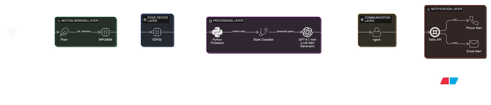

# 🌱 Plant Motion AI – Outdoor Agricultural Plant Stability Monitoring System

## 🎥 Demo Video
🔗 Watch here: https://youtube.com/your-link

---

## 👥 Team Introduction

**Team Name:** Nature AI 
**Name:** Mohammed Thahoor 

This project was developed individually. In this project, Plant Motion AI, I developed a real-time motion monitoring system using sensor data and rule-based logic to detect abnormal plant tilt and automatically trigger alerts.

---

## Project Description

### 🚨 Problems Addressed

Plant damage caused by wind, weak stems, tilting, or external disturbances is often detected only after visible damage occurs, leading to:
- Crop loss
- Broken stems
- Fallen plants

Most existing smart agriculture and plant monitoring systems focus on:
- Soil moisture
- Temperature
- Humidity

However, they do not monitor physical plant movement, which is often the earliest indicator of structural instability and potential damage.

---

### 🎯 Target Users

- Farmers managing outdoor crops
- Large-scale agricultural field operators
- Agricultural monitoring and automation companies
- Rural farming communities adopting IoT-based systems

---

### 🧠 Overall Design

Plant Motion AI is an IoT + AI-based monitoring system that detects abnormal plant movement and fall risk conditions using motion sensor data.

The system works as follows:

1. An **MPU6050 motion sensor** continuously monitors tilt angle and vibration.
2. The sensor is connected to an **ESP32 microcontroller**.
3. The ESP32 processes motion data and transmits it via USB.
4. Rule-based logic classifies tilt patterns as normal, stress, or fall risk.
5. When stress or fall risk is detected:
   - 📞 A Twilio emergency call is triggered
   - 📧 An email alert is sent to the user

This helps farmers detect early instability and prevent crop damage in outdoor agricultural fields.

---

## 🏗 Design Principle

### 🔷 System Architecture Diagram

**Architecture Flow:**

MPU6050 Sensor → ESP32 → USB → Python Processing Script → Rule-Based Logic → GPT-4.1 mini (Dynamic Alert Generation) → ngrok (Public Tunnel) → Twilio API → User (Call / Email)

---

### 🔷 Hardware Connection Diagram

**Connection Overview:**

- MPU6050 → ESP32 (I2C Communication)
  - VCC → 3.3V
  - GND → GND
  - SDA → GPIO21
  - SCL → GPIO22

The sensor communicates with ESP32 using I2C protocol for continuous tilt and acceleration monitoring.

---

## 🧩 Hardware List

- ESP32 LOLIN32 Wireless Development Board (WiFi + Bluetooth)
- MPU6050 6-DOF IMU Sensor Module (GY-521 – Accelerometer & Gyroscope)
- Jumper Wires (Female-to-Female)
- USB Cable (for ESP32 power and data transmission)
- Smartphone (for alert receiving)

---

## 💻 Technology Stack

- C++ (ESP32 programming)
- Python (AI logic & processing)
- OpenAI GPT-4.1 mini (LLM integration)
- Twilio API (Emergency call alerts)
- ngrok (Secure public tunnel for webhook exposure)
- SMTP Email Service (Email notifications)
- I2C Communication Protocol

---

## 🏁 Conclusion

Plant Motion AI demonstrates how AI and IoT can work together to enhance plant safety in smart environments. 

By combining motion sensing, edge processing, and automated alerts, this project provides a scalable and intelligent smart plant protection system aligned with modern smart agriculture ecosystems.

---
